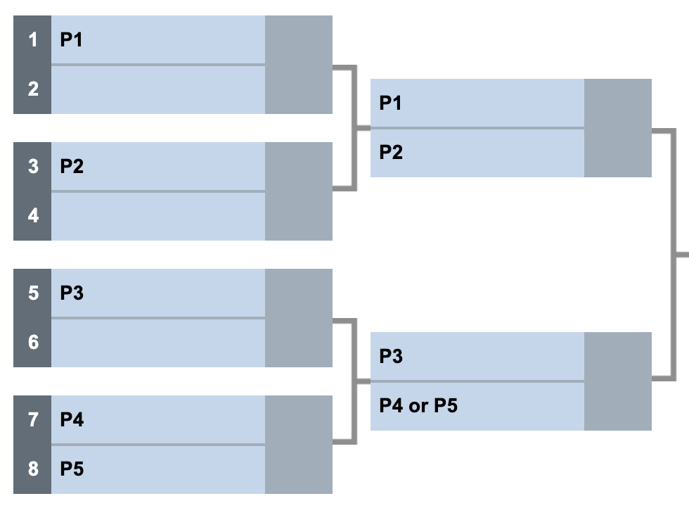

# 🎲 The Game of Not One

- [The Rules](#the-rules)
- [Example Game](#example-game)
- [Getting Started](#getting-started)
- [Creating Your Own Player](#creating-your-own-player)
- [Changing Who Plays](#changing-who-plays)
- [Hints](#hints)

As best I can tell, Not One was first published in the [Nov-Dec 1974 issue of _Creative Computing_ magazine](https://videogamegeek.com/videogame/246481/notone). The game was originally implemented in Basic.

## The Rules

The game of Not One is played between two players, with two dice. The rules are simple:

1. On their turn, a player can roll the dice as often as they wish.
1. Each successful roll adds to the player's score for that turn.
1. After the first roll, if the player throws a one on either of the dice, their turn ends and their turn score is zero. (This is _not_ a successful roll.)
1. If the player chooses to not roll again, their turn is finished and their turn score is added to their total score.
1. A round is finished when both players have had one turn.
1. After ten rounds the player with the highest score wins.

## Example Game

Aiden and Carter play. Round 1 goes like this:

Aiden's turn:

```
ROLL 1: 6, 4 -> Aiden's turn score is now 10
ROLL 2: 3, 5 -> Aiden's turn score is now 18
ROLL 3: 5, 1 -> Uh oh! Aiden's turn score is 0 and the turn is finished
```

Carter's turn:

```
ROLL 1: 6, 3 -> Carter's turn score is 9
ROLL 2: 2, 5 -> Carter's turn score is 16
ROLL 3: 4, 5 -> Carter's turn score is 25
Carter decides to not roll again and the turn is finished
```

After Round 1, Aiden has 0 total points and Carter has 25 total points.

Round 2:

Aiden's turn:

```
ROLL 1: 6, 4 -> Aiden's turn score is now 10
ROLL 2: 2, 2 -> Aiden's turn score is now 14
Aiden decides to not roll again and the turn is finished
```

Carter's turn:

```
ROLL 1: 5, 4 -> Carter's turn score is 9
ROLL 2: 2, 2 -> Carter's turn score is 13
ROLL 3: 3, 5 -> Carter's turn score is 21
ROLL 4: 3, 4 -> Carter's turn score is 28
ROLL 5: 4, 3 -> Carter's turn score is 37
Carter decides to not roll again and the turn is finished
```

After Round 2, Aiden has 0 + 14 or 14 total points and Carter has 25 + 37 or 62 total points.

Play continues like this for eight more rounds.

## Getting Started

1. Fork this repo.
1. Clone the forked repo and change into the `kata-notone` directory.
1. Run `poetry install` to get all the dependencies in place.
1. Run `poetry shell` to activate the virtualenv.
1. Run `notone` to see the game played by the two example players, Aggro Aiden and Cautious Carter. You should see something like this:

```console
$ notone
NOT ONE

ROUND 1
  AGGRO AIDEN
    🎲: 2+3 ✅ 5
    🎲: 4+4 ✅ 13
    🎲: 2+6 ✅ 21
    🎲: 2+3 ✅ 26
    🎲: 6+3 ✅ 35
    🎲: 3+5 ✅ 43
    SCORE: 43
  CAUTIOUS CARTER
    🎲: 3+3 ✅ 6
    🎲: 5+1 ❌ 0
    SCORE: 0

...

GAME OVER

FINAL SCORE
😤 Aggro Aiden: 0 in 31 rolls
😳 Cautious Carter: 156 in 28 rolls

WINNER: 😳 Cautious Carter
Oh I won? That's good, right?

$
```

Once you can play the game with the example players, you're ready to start creating your own player, as described below.

## Creating Your Own Player

The game comes with two players, `notone/players/aggro_aiden.py` and `notone/players/cautious_carter.py`, that you can look at and use as examples. They are also very bad players, so learn from their naivete and make a better player.

There is also a template for creating your own player: `notone/players/template.py`. I recommend duplicating that file, renaming it based on the name you come up with for your player, and implementing the methods you find inside. There are four functions to implement, three of which are trivial and there for fun and flair:

- `name()`: This function should return your player's name.
- `emoji()`: This function should return an emoji associated with your player's personality.
- `victory_cry()`: This function returns a taunt, jeer, or cheer your player will utter should they prove triumphant.

The final function, `roll_again()`, is the most important one: it's the function that decides if your player is going to roll again—risking a turn-killing one—or play it safe and end their turn.

`roll_again()` receives a `state` argument, which represents everything, as a `GameState` instance, you need to know about the game's current state in order to make this critical decision. Here are the properties in the `state` argument:

- `active (int)`: The index (0 or 1) of the player currently taking their turn.
- `rolls (tuple[int, int])`: How many total rolls both you and your opponent have made.
- `round (int)`: Which round we're in (out of 10).
- `scores (tuple[int, int])`: What the total scores are, both yours and your opponent's.
- `turn_rolls (int)`: How many rolls you've made within your current turn
- `turn_score (int)`: What your score is within your current turn.

## Changing Who Plays

In the `notone/players/__init__.py` file you'll see the following lines:

```python
players: list[ModuleType] = [
    add("notone.players.aggro_aiden"),
    add("notone.players.cautious_carter"),
]
```

You can modify that list to change which players are in the game. For example, if you wanted to put your player—we'll call them Happy Harper and assume their implementation is in a `happy_harper.py` file—up against Cautious Carter, you'd modify the code above to be:

```python
players: list[ModuleType] = [
    add("notone.players.hero_harper"),
    add("notone.players.cautious_carter"),
]
```

You can also activate single player mode if you want to just exercise your player without an opponent by just having a single player in the list:

```python
players: list[ModuleType] = [
    add("notone.players.hero_harper"),
]
```

## Playing a Tournament

If you add more than 2 players, you'll trigger tournament mode. Not One uses a blind-seeded, single-elimination tournament.

"Blind-seeded" means the teams are seeded (given a ranking from 1-N, where N is the number of players) randomly. The alternative would be to seed them based on their skill, where the best team would be the #1 seed; this is what you see with famous tournaments like college basketball during March Madness. However, since we don't have a regular season or win/loss records to ascertain the "skill" of our Not One players, we simply shuffle all the players and randomly assign seeds.

"Single-elimination" means that, if you lose once, you're out of the tournament. There are also double-elimination tournaments, brackets for the losers, round robin play, and all sorts of other approaches that are more complicated to model ([Cambridge has an online math lesson on the topic](https://nrich.maths.org/1443)), so we're keeping things simple with single-elimination.

### Field Size & Byes

Single-elimination tournaments must have a power of 2-sized number of entries, that is, a field of 2 (2^1), 4 (2^2), 8 (2^3), 16 (2^4), 32 (2^5), and so on. So what do we do if the number of entries is not a power of 2? In that case, we leave the rest of the slots empty (or in code a null value, which is `None` in Python). Teams who don't have an opponent the first round have what's called a "bye"; they automatically advance to the next round. For example, if you add five players, it will give three of them byes… that is, three more entries will be added to the field, but instead of being players they're simply null values. Think of the empty slots in the bracket below as null or `None` values.



## Hints

- `active` is handy for snagging your total score (`state.scores[active]`) and your total rolls (`state.rolls[active]`).
- `active` can _also_ be flipped to get your opponent's total score and rolls by using the calculation `1 - active`. For example, if `active` is `0`, `1 - active` will give you `1`. If `active` is `1`, `1 - active` gives you `0`.
- There are all sorts of strategies you can pursue, so be creative! The best algorithms typically use multiple strategies. For example, in early rounds, say `state.rounds < 7`, you may pursue a more conservative strategy but get aggressive in the last few rounds. Or you may switch between conservative and aggressive strategies depending on whether you're ahead of your opponent or not.
- Test, test, test! There is a `tests` directory and tests can be executed by running `pytest .`. You can write unit tests that just exercise `roll_again()`, you can write end-to-end tests that run a whole game (or 10,000 whole games!), or you can employ multiple types of tests. At the end of the day tests will be critical for fine-tuning your strategies and maxing out your score.
